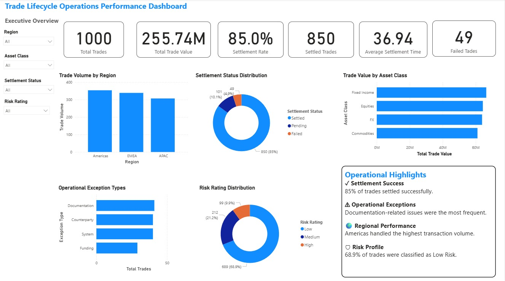

# 📊 Trade Operations Analytics

A complete SQL + Power BI analytics project analyzing the lifecycle of financial trade operations.

---

## 📌 Project Overview

This project analyzes 1,000 simulated trade operations to identify business trends, settlement performance, regional activity, and risk exposure.

The analysis combines SQL for data exploration and Power BI for interactive visualization.

---

## 🛠️ Tech Stack

- SQL Server
- Microsoft SQL Server Management Studio (SSMS)
- Power BI
- Microsoft Excel

---
## 🚀 Skills Demonstrated

- SQL Joins
- Aggregate Functions
- GROUP BY & ORDER BY
- Window Functions (RANK, OVER)
- Common Table Expressions (CTEs)
- CASE Statements
- Running Totals
- Business KPI Analysis
- Power BI Dashboard Design
- Data Visualization


---
## 📂 Repository Structure

```
Dataset/
Images/
Power BI/
SQL/
README.md
```

---

## 🔍 SQL Analysis

The project contains five SQL modules:

- Data Exploration
- Business Analysis
- Settlement Analysis
- Risk Analysis
- Advanced SQL (Window Functions, CTEs, Ranking, Running Totals)

---

## 📈 Dashboard Highlights

- Total Trades
- Trade Value
- Settlement Rate
- Trade Distribution by Region
- Trade Distribution by Asset Class
- Settlement Status Analysis
- Risk Analysis

---
## ⭐ Key Features

- Interactive Power BI Dashboard
- SQL-Based Business Analysis
- Regional Trade Performance
- Settlement Status Analysis
- Risk Analysis
- Asset Class Performance
- Advanced SQL Queries using Window Functions and CTEs

---

## 💡 Business Insights

- Americas generated the highest trade volume.
- Fixed Income accounted for the largest trade value.
- 85% of trades were successfully settled.
- Low-risk trades dominated the dataset.
- SQL window functions were used for ranking and running totals.

---

## 📷 Dashboard Preview



---

## 👤 Author

**Ujjvaltej Madutha**

Business Analytics Student

📧 LinkedIn: (https://www.linkedin.com/in/ujjvaltej/)

💻 GitHub: https://github.com/ujjvaltej9
